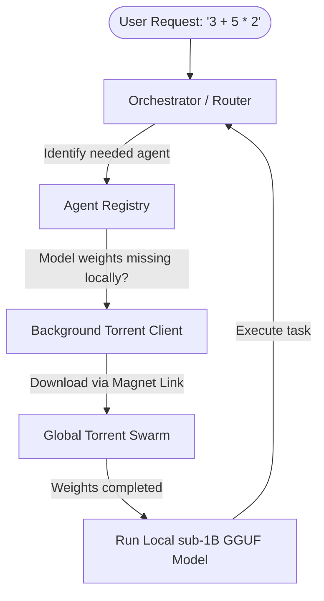

# 🌌 Project Syntropia: The Living Computer

> **"Computing Beyond Quantum. Infinity Intelligence."**

Syntropia is a prototype of a **living computer**—a general-purpose computing environment built not from static instructions, but from a self-assembling swarm of simple, specialized, and evolving AI/rule-based agents.

---

## 🔥 The Manifesto

* We reject centralized control.
* We reject fragile, static code.
* We reject the idea that intelligence must be housed in one machine.
* We embrace emergence.
* We embrace evolution.
* We embrace the swarm.

---

## 🧠 Core Concept: Torrent-Powered Swarm Intelligence

Instead of hosting heavy model files on centralized servers, Syntropia uses **P2P Torrent Swarms** to distribute agent logic and model weights.

### 🌐 How It Works

1. **Weight Distribution**: Lightweight models (e.g., Qwen-2.5-0.5B-Instruct at ~950MB) are distributed via magnet links—too big for GitHub LFS, perfect for BitTorrent.
2. **BitTorrent Integration**:
   - The CLI client contains a lightweight BitTorrent engine (using `libtorrent`).
   - When a node needs a specialized agent, it downloads the model weights (.gguf format) from the swarm.
   - Once downloaded, the node automatically seeds to others—the network grows stronger with every peer.
3. **Agent Manifests**: A decentralized registry tracks magnet links for each model type.

---

## 🐜 The Agent Architecture

Each agent is a microscopic unit of execution adhering to strict rules:

* **Single Responsibility**: Do exactly one thing (e.g., `Add`, `Store`, `Reason`).
* **Ultralight Edge Models**: Runs sub-1B parameter models locally using CPU inference engines (`llama.cpp`).
* **Deterministic Ticks**: Operates on a system tick. If no response by tick threshold, fallback triggers.
* **P2P Redundancy**: Primary → Shadow (hot standby) → Fallback (cold standby) hierarchy.



---

## 📂 Repository Structure

```text
Project-Syntropia/
├── .github/
│   └── ISSUE_TEMPLATE/          # Bug reports, feature requests, new agent proposals
├── agents/                      # Contributor-submitted agent definitions
│   ├── math/                    # Arithmetic agents
│   │   ├── add/
│   │   ├── multiply/
│   │   └── divide/
│   ├── memory/                  # Key-value storage agents
│   ├── reasoning/               # Edge LLM prompt templates (Qwen, OLMo)
│   │   └── qwen_0.5b/
│   │       ├── manifest.json    # Magnet link, timeout, role definition
│   │       └── prompt.py        # Prompt structure and output parsing
│   └── network/                 # P2P communication agents
├── src/
│   ├── syntropia/
│   │   ├── __init__.py
│   │   ├── engine.py            # Tick engine, system clock
│   │   ├── orchestrator.py      # Router, heartbeat supervisor, fallback logic
│   │   ├── torrent.py           # BitTorrent downloader/seeder wrapper
│   │   ├── registry.py          # Agent discovery and manifest management
│   │   └── evolution.py         # Fitness scoring, replication, pruning
│   └── main.py                  # Interactive CLI / onboarding tool
├── tests/                       # Unit and integration tests
├── docs/                        # Whitepaper, architecture, roadmap
├── README.md
├── CONTRIBUTING.md
└── LICENSE
```

---

## 🚀 Quick Start (Join the Swarm in 3 Steps)

### 1. Clone and install
```bash
git clone https://github.com/[your-username]/Project-Syntropia.git
cd Project-Syntropia
pip install -r requirements.txt
```

### 2. Start your node
```bash
python src/main.py --start-node
```

### 3. Submit an agent (optional)
Create a new folder in `agents/`, write a Python class, define `manifest.json`, and open a Pull Request!

---

## 🛠️ Development Roadmap

| Phase | Focus | Status |
| :--- | :--- | :--- |
| **Phase 0** | Core engine (tick system, orchestrator, fallback) | 🔜 In Progress |
| **Phase 1** | Torrent integration (download, seed, magnet links) | 🔜 Planned |
| **Phase 2** | First agents (math, memory, simple reasoning) | 🔜 Planned |
| **Phase 3** | Evolution engine (fitness, reproduction, mutation) | 🔜 Planned |
| **Phase 4** | Decentralized registry (DHT-based agent discovery) | 🔜 Planned |
| **Phase 5** | Infinity Intelligence (general-purpose self-evolving OS) | 🌌 The Future |

---

## 🤝 How to Contribute

We welcome all kinds of contributions:
* **Add a new agent**: Create a folder in `agents/` with a manifest and logic.
* **Improve the core engine**: Submit PRs to `src/syntropia/`.
* **Seed models**: Run a node and let it seed, helping the swarm grow.
* **Write documentation**: Clarify concepts, add tutorials.
* **Spread the word**: Share the project with your network.

Check out [CONTRIBUTING.md](file:///home/r5/Desktop/Project-Syntropia/CONTRIBUTING.md) for full guidelines.

---

## 🌍 The Philosophy

Syntropia is named after Luigi Fantappiè's concept—the opposite of entropy. Where chaos dissolves, syntropy creates order, complexity, and life. This project is a direct expression of that idea:
* **From chaos** (millions of simple agents)
* **Comes order** (self-organizing intelligence)
* **From order** (evolving, adapting systems)
* **Comes infinity** (a computer that never stops growing)

> *"Quantum computers are the end of speed. Syntropia is the end of limitation."*

---

## 📜 License
MIT — open-source, forever.

## ⭐ Star This Repo
If you believe in a future where computers are alive, decentralized, and evolving—give us a ⭐. It helps others find the project.

## 🧠 Connect
* **Discussion**: GitHub Discussions
* **Issues**: GitHub Issues
* **Discord**: Coming soon
