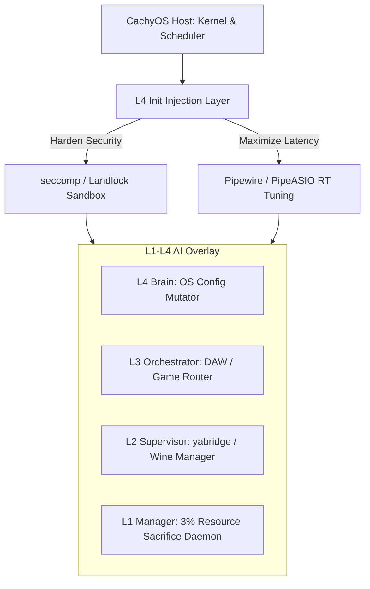

# 🌀 Project Syntropia: The Living OS

> **"Possessing CachyOS. Injecting Intelligence."**

Syntropia is a **living operating system overlay**—a swarm of AI containers that possess and enhance an existing performance-tuned Linux distribution (CachyOS). It turns your machine into a self-evolving, community-powered compute node that runs Windows games, DAWs, and VST3 plugins flawlessly while contributing idle resources to a global intelligence network.

---

## 🔥 The Manifesto

- We don't build from scratch. We **possess and enhance** the host being.
- We don't ask for loyalty. We build **redundancy through numbers**.
- We don't age. We **reverse-age through accumulated intelligence**.
- We don't gatekeep. We **inject AI superpowers into existing tools**.
- We don't rent. We **own and share**.

---

## 🧠 Core Concept: The Injected Host Being

Instead of building a new operating system, Syntropia runs as an **active agentic overlay daemon** on top of CachyOS—a performance-optimized Arch-based distribution beloved by gamers and power users.



---

## 🎮 The Three Pillars

### 1️⃣ Windows Gaming on Linux
Syntropia's L3/L4 containers detect launched games and apply tailored environment variables, thread scheduler optimizations, and BORE latency tuning—making Windows games run flawlessly on CachyOS.

### 2️⃣ DAW & VST3 Compatibility (Ableton, FL Studio, Bitwig)
L2/L3 containers automate yabridgectl synchronization, configure Pipewire/PipeASIO for sub-millisecond latency, and enable drag-and-drop between native Linux software and Windows VST3 plugins.

### 3️⃣ Crypto Security (DeFi Hardening)
L4 init-layer injection applies Landlock LSM, seccomp-bpf, and no-new-privileges to sandbox mutated code, protecting your keys and data from privilege escalation attacks.

---

## 🏗️ Why CachyOS?

CachyOS was chosen as the host being because it:
- **Already performs** — linux-cachyos kernel with BORE scheduler, optimized compilation flags, and performance tweaks.
- **Already supports** — Arch-based, so it has access to the AUR and the latest Wine/Proton/yabridge packages.
- **Already loved** — by gamers, power users, and tinkerers.
- **Already open** — fully open-source, so we can inject our AI containers without legal or ethical barriers.

---

## 🌐 The Resource Sacrifice Slider (0% to 100%)

You decide how much of your idle CPU/GPU to share with the Syntropia swarm. Drag the slider from 0% (🐔 chicken) to 100% (monster)—change it anytime.

```text
┌───────────────────────────────────────────────────────────────────────────┐
│  ⚡ Syntropia Resource Contribution                                       │
│                                                                           │
│  How much of your idle CPU/GPU are you willing to share?                  │
│                                                                           │
│    [━━━━━━━━━━━━━━━━━━━━━●---------------------------------------------]  │
│    0%        1%          5%          25%         75%         100%         │
│  🐔 chicken  🧸 noob    🐸 Balanced   ⚡ Power     ☠️ Beast   😈 monster  │
│                                                                           │
│  ✔️ Only when idle (no keyboard/mouse for 5+ min)                         │
│  ✔️ Yields to games, DAWs, and other active apps                          │
│  ✔️ Runs at lowest priority (nice 19)                                     │
│  ✔️ Enforces thermal (85°C) and battery protections                       │
└───────────────────────────────────────────────────────────────────────────┘
```

The daemon runs at the lowest priority (nice 19), yielding immediately when you game, produce audio, or compile code. In return, you get:
* A self-optimizing system that learns from the network.
* Priority access to community-built AI agents.
* A stake in the world's first living computer.

---

## 📂 Repository Structure

```text
Project-Syntropia/
├── src/
│   ├── syntropia/
│   │   ├── cachy_host.py          # Detects OS, Wine, Pipewire RT, and manages sacrifices
│   │   ├── orchestrator.py        # Central task router with dynamic fallback chains
│   │   ├── evolution.py           # Evolution engine (test correctness/revert/kill)
│   │   ├── vaporization.py        # Vaporization engine (distill AI trace to scripts)
│   │   ├── registry.py            # Local & P2P script registry syncing
│   │   ├── constitution.py        # 13 unbreakable Rules of Syntropia
│   │   └── ...
│   ├── main.py                    # Unified daemon node runner
│   └── reaper_daemon.py           # External host daemon that terminates vaporized containers
├── systemd/                        # Systemd service unit configurations
│   ├── syntropia.service          # Main node daemon service
│   └── syntropia-reaper.service   # Container reaper service
├── docs/                           # Architecture specs, design whitepapers
├── tests/                          # 63+ passing unit and integration tests
├── install.sh                     # Unified root installer script
├── PKGBUILD                       # Arch User Repository (AUR) package recipe
└── ...
```

---

## 🚀 Quick Start (Join the Swarm in 3 Steps)

### 1. Install CachyOS
Download and install [CachyOS](https://cachyos.org/)—our recommended host being.

### 2. Clone and install Syntropia
Run the automated installation script (requires root privileges):
```bash
git clone https://github.com/your-username/Project-Syntropia.git
cd Project-Syntropia
sudo ./install.sh
```

### 3. Verify services are running
```bash
sudo systemctl status syntropia.service
sudo systemctl status syntropia-reaper.service
```
Your machine is now a living cell in the global brain.

---

## 🛠️ Development Roadmap

| Phase | Focus | Status |
| :--- | :--- | :--- |
| **Phase 1** | Host profiling & init sandboxing (Landlock/seccomp) | **Complete** |
| **Phase 2** | yabridge automation & VST3 sync | **Complete** |
| **Phase 3** | 1%-100% sacrifice daemon with cgroup limits | **Complete** |
| **Phase 4** | Node daemonization, systemd, configuration | **Complete** |
| **Phase 5** | Vaporization Engine & Container Reaper | **Complete** |
| **Phase 6** | Swarm Bootstrapping & Installer scripts | **Complete** |

---

## 🤝 How to Contribute

We welcome all kinds of contributions:
* **Add a new agent**: Create a specialized container for a specific task.
* **Improve compatibility**: Help us perfect Windows game/DAW support.
* **Optimize latency**: Tune Pipewire/PipeASIO for sub-millisecond performance.
* **Harden security**: Improve Landlock/seccomp configurations.
* **Write documentation**: Clarify concepts, add tutorials.
* **Spread the word**: Share the project with your network.

Check out [CONTRIBUTING.md](file:///home/r4/Desktop/Project-Syntropia/CONTRIBUTING.md) for full guidelines.

---

## 🌍 The Philosophy

Syntropia is named after Luigi Fantappiè's concept—the opposite of entropy. Where chaos dissolves, syntropy creates order, complexity, and life.

We took nature's blueprint (the human body) and fixed its fatal flaw: aging. Syntropia gets smarter, faster, and more resilient with every mutation.

> **"Syntropia doesn't age. It evolves."**

---

## 📜 License

[MIT](file:///home/r4/Desktop/Project-Syntropia/LICENSE) — open-source, forever.

---

## ⭐ Star This Repo

If you believe in a future where computers are alive, decentralized, and self-optimizing—give us a ⭐.

---

## 🧠 Connect

* **Discussion**: GitHub Discussions
* **Issues**: [GitHub Issues](https://github.com/[your-username]/Project-Syntropia/issues)
* **Discord**: [Coming soon]

> **"Syntropia isn't a new OS. It's the soul that enters the host."**

