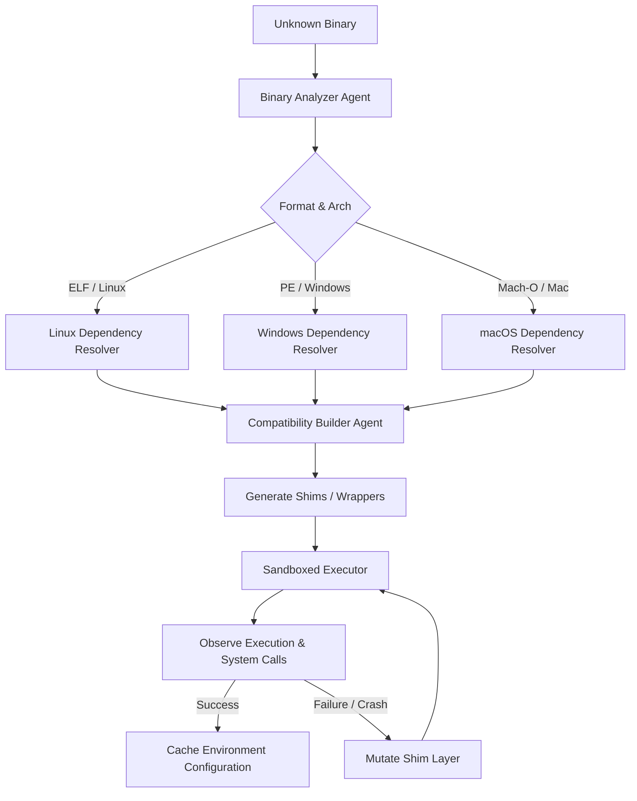

# 🌀 Syntropia: Universal OS Mutator & Binary Analyzer Plan

This plan details the design and implementation of the **Binary Analyzer Agent**, which forms the first critical layer of the **Universal OS Mutator** architecture. The goal of this agent is to analyze any given binary file, determine its target Operating System and CPU architecture, and resolve all its external library dependencies.

---

## 🧬 Architectural Overview: The Mutator Loop

The "Universal OS Mutator" adapts to program needs rather than forcing a program to match a static environment. It operates in a continuous evolutionary loop:



---

## 🛠️ Binary Analyzer Agent Design

The agent will reside in `agents/binary_analyzer/` and adhere to Syntropia's single-responsibility execution model.

### 1. Agent Manifest (`manifest.json`)
```json
{
  "name": "BinaryAnalyzerAgent",
  "role": "binary_analyzer",
  "timeout": 5,
  "model": null,
  "description": "Analyzes binary executable headers (ELF, PE, Mach-O) to resolve OS, CPU architecture, and dynamic library dependencies."
}
```

### 2. Execution Interface (`agent.py`)
The agent class `BinaryAnalyzerAgent` will implement the `execute(self, inputs)` method.
* **Input**: A dictionary containing `{"file_path": "/path/to/binary"}` or a raw byte stream `{"data": b"..."}`.
* **Output**: A structured dictionary:
```json
{
  "status": "success",
  "format": "ELF",          // ELF, PE, Mach-O, Unknown
  "bitness": 64,            // 32 or 64
  "endianness": "little",   // little or big
  "os": "Linux",            // Linux, Windows, macOS, Unknown
  "architecture": "x86_64", // x86_64, x86, arm64, arm, mips, etc.
  "dependencies": [
    "libc.so.6",
    "libm.so.6"
  ]
}
```

---

## 🔍 Parsing Strategies

To maintain Syntropia's requirement for lightweight, zero-daemon execution, the parser will prioritize a **pure-Python parser** followed by **system command fallback**.

### Phase A: Pure-Python Header Parsing
This avoids external package dependencies (like `pefile` or `pyelftools`) and remains extremely lightweight.

#### 1. ELF (Executable and Linkable Format) - Linux
* **Magic Bytes**: `\x7fELF` (offset 0).
* **Bitness**: Offset 4 (`1` = 32-bit, `2` = 64-bit).
* **Endianness**: Offset 5 (`1` = Little Endian, `2` = Big Endian).
* **OS ABI**: Offset 7 (e.g., `0x00` = System V, `0x03` = Linux).
* **Machine/Arch**: Offset 18 (e.g., `0x03` = x86, `0x3e` = x86_64, `0x28` = ARM, `0xb7` = AArch64).
* **Dependencies**: Read Program Header table, find segment of type `PT_DYNAMIC` (`6`), and parse entries. Each entry consists of a tag and a value. If tag is `DT_NEEDED` (`1`), the value is an offset in the dynamic string table (`DT_STRTAB`).

#### 2. PE (Portable Executable) - Windows
* **Magic Bytes**: `MZ` (DOS header, offset 0).
* **PE Signature Offset**: 4-byte integer at offset `0x3c` (points to signature `PE\0\0`).
* **COFF Header**: Starts 4 bytes after PE signature. Contains `Machine` type:
  * `0x14c` = x86, `0x8664` = AMD64/x64, `0xaa64` = ARM64.
* **Optional Header**: Starts 24 bytes after PE signature. Has magic:
  * `0x10b` = PE32 (32-bit), `0x20b` = PE32+ (64-bit).
* **Data Directories**: Located at optional header offset 96 (PE32) or 112 (PE32+). The second entry is the **Import Directory**.
* **Section Table**: Maps virtual addresses (RVAs) to file offsets so we can navigate to the Import Directory and extract DLL names.

#### 3. Mach-O (Mach Object) - macOS
* **Magic Bytes**: `0xfeedface` (32-bit LE), `0xfeedfacf` (64-bit LE), `0xcefaedfe` (32-bit BE), `0xcffaedfe` (64-bit BE). Also FAT magics: `0xcafebabe` and `0xbebafeca`.
* **Dependencies**: Walk Load Commands (`LC_LOAD_DYLIB` = `0x0c` or `0x8000001c`) to extract library paths.

### Phase B: System Tool Fallback
If the pure-Python parser fails or reports "Unknown", the agent will run subprocess tools native to the host:
* Linux: `readelf -d <binary>`, `ldd <binary>`, or `file <binary>`.
* macOS: `otool -L <binary>` or `file <binary>`.
* Windows: `dumpbin /dependents <binary>`.

---

## 🧪 Test Plan

To verify accuracy and robustness:
1. **Mock Files**: Generate dummy ELF and PE headers in bytes to test the parser without requiring real executable assets in git.
2. **System Binary Validation**: Test the agent against common local binaries (e.g., `/bin/ls` or `/bin/sh` on Linux).
3. **Registry Check**: Verify the agent loads correctly via the `AgentRegistry` and runs under the `Orchestrator` execution framework.
