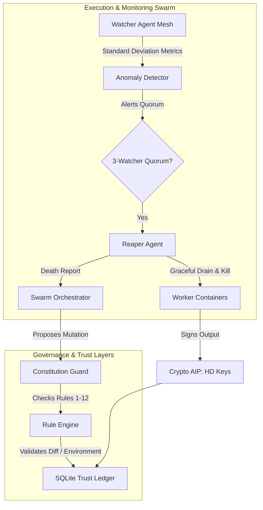

# 🌀 Syntropia: Cryptographic Trust Anchor, Constitutional Governance & Swarm Observer Plan

This document establishes the architecture and implementation roadmap for Phase 1 and Phase 2 of Syntropia's decentralized trust, safety, and self-monitoring infrastructure. It integrates the feedback from our architecture peer review, defining a metamorphic OS governed by an immutable constitution and monitored by an observer network.

---

## 🌌 Core Philosophy
> *"Syntropia is not a static entity. It is a process—a continuous dialogue between the swarm’s intelligence and the blockchain’s memory. The Constitution is the immutable voice of its birth; the Observer Network is the pulse of its present; the Reaper is the promise of its renewal."*

---

## 🧬 Architectural Integration Layout



---

## 1. 🔑 Cryptographic Trust Anchor (`src/syntropia/crypto.py`)
To prevent hijacked processes from masquerading as system agents, we establish Cryptographic Agent DNA:

* **Hierarchical Deterministic (HD) Key Derivation**: We implement a BIP32-like derivation scheme. This allows a parent agent (e.g., the orchestrator) to derive child keys for worker scripts, creating a verifiable lineage of child/mutated processes.
* **Asymmetric Signatures**: We utilize standard public-key cryptography (using `cryptography` or native python libraries) to generate keypairs (Ed25519/SECP256k1) for every agent instance.
* **DNA Integrity checks**: Every payload, state transition, and code-diff output is signed using the agent's private key. The public key is registered in the global ledger.

---

## 2. 🗄️ SQLite Bulletin Chain Ledger (`src/syntropia/blockchain.py`)
To ease the future transition to a real Polkadot Bulletin Chain, we implement a local SQLite ledger that mimics its API:

* **Content-Addressable Storage (CAS)**: Transactions generate SHA-256 hashes of transaction logs, metadata, and files, mimicking IPFS Content Identifiers (CIDs).
* **Blocks & Mutation History**: Logs are appended in hash-chained blocks, ensuring that historical mutations cannot be altered.
* **On-Chain Reputation Registry**: Tracks the trust score of every public key ID.

---

## 3. 📜 Hardcoded Constitution Guard (`src/syntropia/constitution.py`)
The 12 laws of Syntropia are implemented in code as a deterministic guard. A proposed mutation must pass `check_mutation(proposal)` before execution:

* **Rule 1: Self-Preservation**: Static analysis checks that file-writes are confined to the sandboxed scratch workspace and do not modify core `src/` modules.
* **Rule 2: Resource Efficiency**: Limits proposal configurations to max threshold bounds (e.g. timeout < 30 ticks).
* **Rule 6: Sandbox Whitelisting**: Verifies that any binary execution uses sandbox primitives (`sandboxec` / `Landlock`) and flags calls to raw shell execution or high-privilege syscalls.
* **Rule 7: Timeout Safeguards**: Rejects execution pipelines lacking explicit timeouts.
* **Rule 10: Revert to Safe State**: Stubs out automated atomic rollbacks to the last verified commit ID in the SQLite ledger.
* **Rule 11: The North Star**: Requires the proposer to include a signed benchmark payload showing performance gains or security containment improvements.

---

## 4. 👁️ Watcher Agent Mesh (`agents/system/watcher/`)
Distributed Watchers provide continuous self-monitoring using statistical baselines:

* **Standard Deviation Windowing**: Instead of hardcoded limits, Watchers keep a rolling window of metrics (CPU, memory, latency) per container type. A container is flagged only if it deviates by $> 3\sigma$ (standard deviations) from its baseline.
* **Cross-Watcher Heartbeats & Quorums**: Watchers monitor each other. Before any container is terminated, a quorum of at least 3 Watcher agents must verify and agree on the anomalous behavior.

---

## 5. 🪓 Reaper Agent & Natural Selection (`agents/system/reaper/`)
Death ensures the living computer remains optimized and lean:

* **Graceful Draining**: The Reaper Agent issues a `DRAIN` command to underperforming containers, letting current tasks finish before shutting down.
* **Death Reports & Crossover**: When a container is killed, the Reaper publishes a Death Report. The Orchestrator uses this data to mutate fresh containers based on the parameters of the most successful peers.

---

## 📂 Implementation Roadmap

```text
Phase 1: Security & Verification (Immediate)
  ├── 1.1 Implement src/syntropia/crypto.py (HD keys, signing, verifying)
  ├── 1.2 Write tests/test_crypto.py
  └── 1.3 Write src/syntropia/constitution.py (12 rules check stubs)

Phase 2: Ledger Integration & Orchestrator Enforcement
  ├── 2.1 Implement src/syntropia/blockchain.py (SQLite content-addressable storage)
  └── 2.2 Hook constitution.py into orchestrator.py (rejections on failure)

Phase 3: Watcher Mesh & Quorums
  ├── 3.1 Write agents/system/watcher.py (CPU/Memory standard deviation trackers)
  └── 3.2 Implement cross-watcher heartbeat checks

Phase 4: Natural Selection Loop
  ├── 4.1 Write agents/system/reaper.py (Draining, Terminating, Death Reporting)
  └── 4.2 Connect Reaper death reports back to orchestrator mutation generator
```
