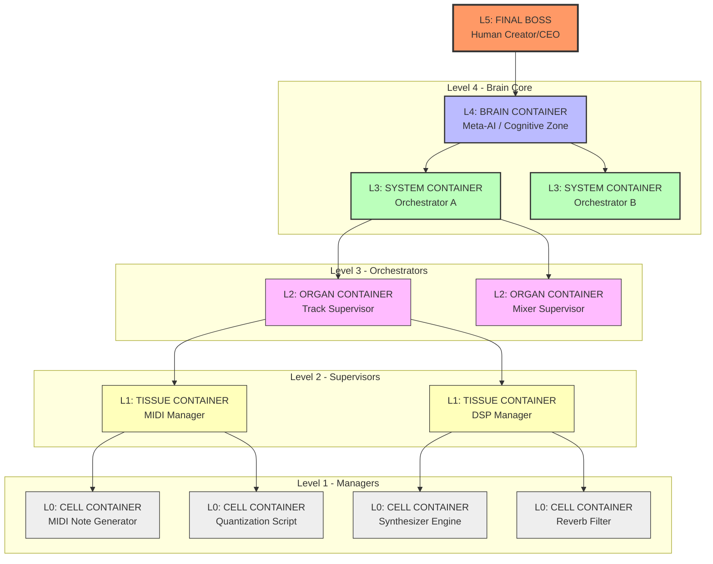

# 🌌 Syntropia Container Hierarchy: Groups within Groups

> **"Hardware is the body. Containers are the cells. The network is the brain."**
>
> In Syntropia, we reject static operating systems. Computation is performed by a nested, self-assembling hierarchy of virtualized container nodes that act as digital cells. This document maps the architecture of these containers, their nested groupings ("groups within groups"), and the intelligence requirements at each layer.

---

## 🗺️ The Nested Consciousness Map

At the top of the hierarchy is the human user (the Final Boss). Below the Final Boss are Brain Cores, which direct Orchestrator Systems. These systems supervise Functional Organs, which manage Tissues, which coordinate the raw computing Cells (Workers).



---

## 🧬 Container Tiers & Intelligence Specification

| Level | Container Name | Biological Analogy | AI Intelligence Level | Hardware Profile (RAM/CPU) | Primary Responsibility |
| :--- | :--- | :--- | :--- | :--- | :--- |
| **L5** | **Final Boss** | The Soul / Will | **Human Intelligence** | External Client / CLI | Define global objectives, approve mutations, override safety interrupts. |
| **L4** | **Brain Core** | Cerebral Cortex | **Large LLM** (70B+ params) | 16GB+ RAM / VRAM | Decompose L5 missions into system-wide strategies; execute evolution/mutations. |
| **L3** | **Orchestrator** | Nervous System | **Medium LLM** (7B-13B params) | 8-16GB RAM / Multi-Core | Route execution requests; load-balance compute; monitor organ heartbeats. |
| **L2** | **Supervisor** | Organ | **Small LLM** (1.5B-3B params) | 4-8GB RAM / Dual-Core | Maintain logical flow of a specific department (e.g. MIDI audio vs DSP audio). |
| **L1** | **Manager** | Tissue | **Tiny LLM / Rules** (0.1B-0.5B) | 1-4GB RAM / Single Core | Spawn, monitor, and clean up L0 worker scripts; accumulate outputs. |
| **** | **Worker / Cell** | Cell / Transistor | **Deterministic (No AI)** | <512MB RAM / Millicore | Run fast, sandboxed binary/script computations; exit immediately. |

---

## 📋 The "Empty Map" JSON Schema

This schema defines how a nested container group is structured. Every container is a node that can potentially contain a group of child nodes.

```json
{
  "$schema": "https://syntropia.org/schemas/container-node.json",
  "id": "container_id_string",
  "name": "human_readable_name",
  "level": "L0|L1|L2|L3|L4|L5",
  "role": "functional_role_description",
  "intelligence_tier": "human|heavy|medium|light|ultra-light|none",
  "parent_id": "parent_container_id_or_null",
  "runtime": {
    "engine": "python|wasm|seccomp_subprocess|docker_emulated",
    "script_path": "relative/path/to/muscle/script.py",
    "model_magnet_link": "magnet:?xt=urn:btih:..."
  },
  "resource_limits": {
    "memory_mb": 512,
    "cpu_cores": 1.0,
    "timeout_ticks": 5
  },
  "status": "idle|running|failed|mutating",
  "reputation": 100.0,
  "children": [
    {
      "comment": "Nested child containers (groups within groups)"
    }
  ]
}
```

---

## 🎼 Case Study: A Distributed DAW (Digital Audio Workstation)

How does a global living computer produce a single sound? Here is the mapped out workflow under the empty map:

```text
[L5: Final Boss (User)] -> "Generate a techno track with a heavy kick and reverb."
  │
  └──> [L4: DAW Brain Core]
         ├── Decomposes instruction: Needs rhythmic structures, synthesizer routing, and FX filters.
         ├── Spawns/Assigns L3 Orchestrator.
         │
         └──> [L3: DAW Studio Orchestrator]
                ├── Balances routing between Audio-Track-Generators and Master-Mixer.
                ├── Routes to Track-1-Supervisor and Track-2-Supervisor.
                │
                ├──> [L2: Track-1 Supervisor (Synthesizer Track)]
                │      ├── Coordinates MIDI patterns and sound synth generation.
                │      ├── Spawns L1 MIDI Manager and L1 Audio Render Manager.
                │      │
                │      ├──> [L1: MIDI Generation Manager]
                │      │      ├── Spawns L0 Cells to calculate notes.
                │      │      ├── [L0: Kick MIDI Generator (Script)] -> Output: [Note 36, velocity 100]
                │      │      └── [L0: Bass MIDI Generator (Script)] -> Output: [Note 48, velocity 80]
                │      │
                │      └──> [L1: Sound Synthesis Manager]
                │             ├── Spawns L0 Synth engine to convert MIDI to audio waveforms.
                │             └── [L0: FM Synthesizer (Script)] -> Output: Waveform Buffer
                │
                └──> [L2: Master Mixer Supervisor]
                       ├── Coordinates track output consolidation and FX routing.
                       ├── Spawns L1 FX Manager.
                       │
                       └──> [L1: FX Processing Manager]
                              ├── Spawns L0 Reverb and Compression filters.
                              ├── [L0: Convolution Reverb (Script)] -> Input: Waveform -> Output: Wet Waveform
                              └── [L0: Limiter (Script)] -> Output: Final Stereo Master WAV
```

---

## 🧬 Self-Evolution & Mutation Trajectory

Because containers are software-defined, they are not locked into their roles. If an L1 Manager detects that its L0 workers are underperforming (e.g. a Python MIDI generator is too slow):
1. The **L1 Manager** reports this to the **L2 Supervisor**.
2. The **L2 Supervisor** requests a mutation from the **L4 Brain Core**.
3. The **L4 Brain Core** uses its Large LLM to generate a new, optimized worker script in Rust/C (compiled to WebAssembly for safety).
4. The **L4 Brain** checks the mutation against the **Constitution Guard** (e.g., verifying it doesn't violate sandbox guidelines and is faster).
5. Upon verification, the old L0 container is deleted, and the new mutated L0 container is spawned in its place.

*The machine has evolved.*
