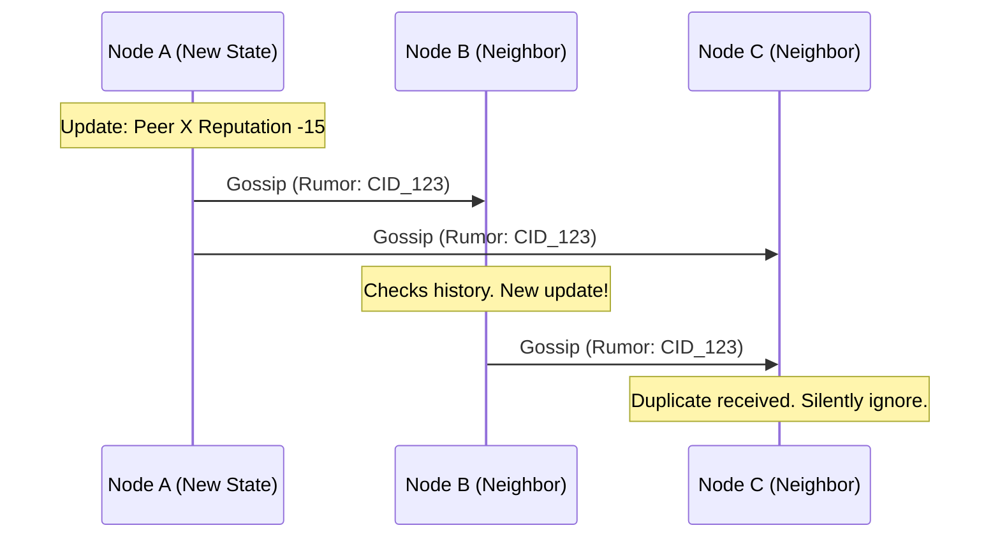

# 🌌 Ephemeral Redundant Storage & Gossip Sync spec

> **"Syntropia doesn't need loyal nodes. It just needs enough."**
>
> This document specifies the memory and state propagation layers of Syntropia. In a decentralized volunteer computer, nodes can connect, execute tasks, crash, or permanently exit at any moment. Rather than relying on peer loyalty, Syntropia achieves persistence through mathematical redundancy and epidemic gossip dissemination.

---

## 🧬 Core Architecture: Churn-Resilient Memory

Syntropia replaces the concept of persistent archiving with **Dynamic Ephemeral Memory**. If a file (e.g., model weights, container manifests, logs) is added to the network, it is split, scattered, and continuously re-seeded.

```text
               [ Original Payload ] (e.g., Code Mutation)
                       │
                       ▼  (Erasure Coding: Reed-Solomon)
        ┌──────────────┬──────────────┬──────────────┐
        ▼              ▼              ▼              ▼
     [Part 1]       [Part 2]       [Part 3]       [Part 4]
        │              │              │              │
        ▼ (Gossip)     ▼ (Gossip)     ▼ (Gossip)     ▼ (Gossip)
    [Node A]       [Node B]       [Node C]       [Node D]
 (Online/Seeds)  (Offline/Dies) (Online/Seeds) (Online/Seeds)
        │                             │              │
        └──────────────┬──────────────┴──────────────┘
                       ▼ (Reconstruction: Any 3 parts)
               [ Original Payload ]
```

---

## 🗂️ 1. Ephemeral Redundant Storage (ERS)

To make file storage completely independent of individual host life spans:

### A. Reed-Solomon Erasure Coding
* Every file payload is split into $K$ data blocks and $M$ parity blocks (totaling $N = K + M$ chunks).
* **Reconstruction Rule**: Any $K$ chunks out of $N$ are mathematically sufficient to reconstruct the entire original file.
* *Example*: $K=4$, $M=6$ ($N=10$). A 40MB model manifest is split into 10 chunks of 10MB each. Even if 6 out of the 10 nodes hosting these chunks go offline permanently, the file can be reconstructed with 100% fidelity from the remaining 4 nodes.

### B. Health-Monitoring & Active Re-replication
* Chunks are content-addressed using their CID (SHA-256 hash).
* A background Orchestrator loop (Level 3/4) monitors the availability of each chunk ID in the DHT.
* **Healing Trigger**: If the number of online peers hosting chunks for a specific CID falls close to $K$ (e.g., only 5 chunks are online for a $K=4$ file), the network prompts surviving hosts to reconstruct the file and generate/scatter new parity chunks, restoring redundancy back to $N$.

---

## 💬 2. Gossip Sync Protocol (Anti-Entropy State Sync)

For metadata that must be globally aligned (e.g., reputation ledgers, the Constitution, mutation logs), Syntropia uses a randomized gossip protocol:



### A. Rumor-Mongering (Push Phase)
* When a node creates or validates a new block (e.g., a mutation log), it broadcasts a lightweight rumor message containing the state's hash (CID) to a random subset of its neighbors.
* Receivers check if they already have this CID. If not, they fetch the full payload, update their local ledger, and forward the rumor to another subset of random neighbors.

### B. Anti-Entropy (Pull Phase / Delta Sync)
* Every logical tick interval (e.g., every 96 ticks / 4 beats), nodes perform an exchange check with a random peer.
* They compare the **Merkle Root hash** of their local ledgers.
* If a mismatch is detected, they exchange Merkle branch hashes to isolate which block heights are missing and pull only the missing state updates.

---

## ⌛ 3. Storage Decay & Churn Economics

To prevent volunteer nodes from running out of disk space, all ephemeral chunks are governed by a decaying cache model:

$$\text{Priority}(t) = \frac{\text{Access Count}}{\text{Current Logical Tick} - \text{Last Access Tick}}$$

* **Decay**: Chunks that are rarely requested fade in priority.
* **Eviction**: When a node's local storage limit is reached, it evicts chunks with the lowest priority score.
* **Incentive**: Nodes earn localized reputation credits by maintaining and seeding rare chunks (chunks where the online count is close to the critical recovery limit $K$).

---

## 🎼 Case Study: Network Recovery Workflow

1. **A DAW Node (Node Alpha) goes offline**: Node Alpha was hosting part 3 of a custom synthesizer mutation.
2. **The Swarm detects churn**: The L3 Orchestrator network queries the DHT and finds that only 4 of the 10 chunks for the synth mutation are online.
3. **Trigger Recovery**: A surviving L3 node downloads the 4 remaining chunks from online peers.
4. **Reconstruct and Re-seed**: The L3 node reconstructs the original mutation payload, generates 6 new parity chunks, and distributes them via DHT to new volunteer nodes.
5. **No Loss of State**: A new user requests the synthesizer container. It is assembled and executed without anyone noticing Node Alpha ever left.

---

## 🔁 4. The "Stateless" Fallback Model

Instead of relying on loyal nodes that store data forever, Syntropia is designed so that any node can die at any time without harming the network. This table describes how storage requirements scale per layer:

| Layer | How It Works | Storage Persistence | Who Needs It |
| :--- | :--- | :--- | :--- |
| **L0 Workers** | No storage. Exit immediately after task. | Completely disposable. | L0 Workers |
| **L1 Managers** | Cache recent results. Exit if idle too long. | Ephemeral cache (local memory). | L0 Workers, L1 Managers |
| **L2 Supervisors** | Store mutation logs and test benchmarks. | Replicated via DHT & Gossip. | L2 Supervisors, L3 Orchestrators |
| **L3 Orchestrators**| Store global network state hash. | Gossip sync & local Merkle trees. | L3 Orchestrators, L4 Core |
| **L4 Core** | Store the Constitution and meta-rules. | Immutable genesis rules, replicated globally. | All containers |

No single node is loyal, but through gossip and replication, the collective network has a memory.

---

## 🔐 5. The Syntropia Blockchain Ledger

The blockchain in Syntropia is not a speculative transaction system—it is the immutable memory and rulebook of the global brain. It is kept extremely lightweight (storing only hashes and signatures) so that blocks can propagate in milliseconds over BFT consensus.

### Data Stored on the Blockchain:
* **Agent Identity**: Permanent public keys mapped to agent names and code hashes.
* **Mutation Logs**: Signed record of every approved mutation (for scientific auditing, not voting).
* **Constitution**: The core 12 unbreakable rules of Syntropia.
* **Reputation Scores**: Aggregated trust ratings for nodes.
* **Global State Hash**: SHA-256 fingerprint representing the correct state of the network.
* **Governance Votes**: Signed override decisions by humans or Core AI.

### Data NOT Stored on the Blockchain:
* **Container Images / Models**: Too large (stored in BitTorrent/IPFS DHT, referenced on-chain by hash).
* **Task Logs**: Too noisy (stored locally or in ephemeral cache).
* **Real-time Messages**: Too fast (broadcast directly via gossip).

### How the Blockchain differs from Typical Chains:
* **Consensus**: Byzantine Fault Tolerant (BFT) rather than heavy PoW or PoS.
* **Tokens**: None. Transactions are reputation-based.
* **Purpose**: Swarm memory and truth verification rather than financial exchange.

