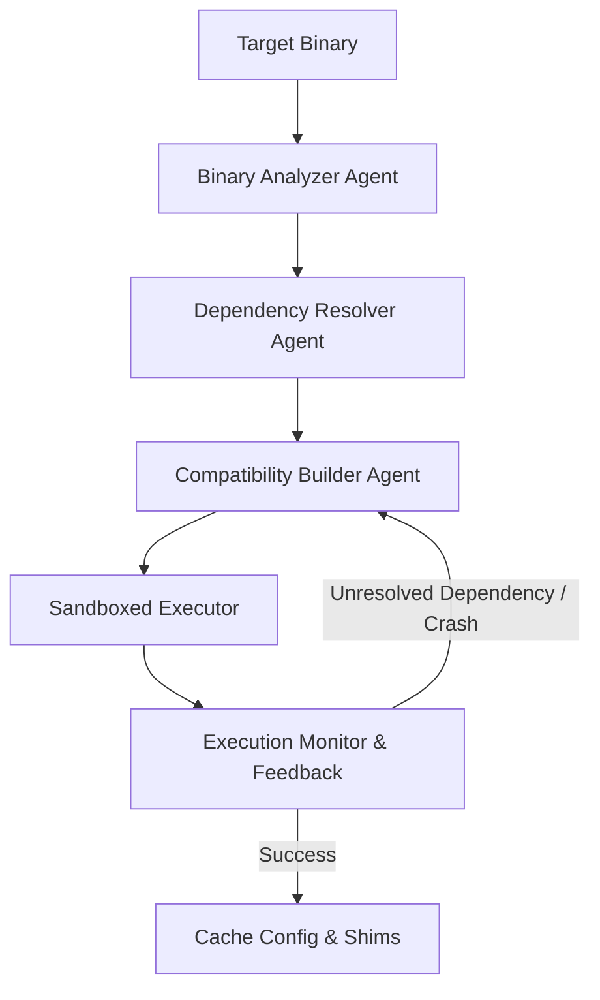

# 🌀 Project Syntropia: Implementation & Community Plan

> **"Computing Beyond Quantum. Infinity Intelligence."**
>
> Syntropia is a prototype of a **living computer**—a general-purpose computing environment built not from static instructions, but from a self-assembling swarm of simple, specialized, and evolving AI/rule-based agents.

This document merges the core conceptual roadmap with the community onboarding structure, detailing our immediate next steps, folder layouts, and P2P torrent-based Edge AI syncing design.

---

## 🌌 The Vision: Torrent-Powered Swarm Intelligence

Instead of hosting heavy model files on centralized servers, Syntropia uses **P2P Torrent Swarms** to distribute agent logic and model weights.

### 🌐 How It Works
1. **Weight Distribution**: Lightweight models (e.g., Qwen-2.5-0.5B-Instruct at ~950MB) are distributed via magnet links. This is too big for standard GitHub repositories but perfect for BitTorrent.
2. **BitTorrent Integration**:
   - The CLI client contains a background BitTorrent engine (using Python `libtorrent` or wrapping a Node/CLI daemon inspired by Thor's Hammer).
   - When a node needs a specialized agent, it checks if the model weights (.gguf format) are present locally. If not, it pulls them from the torrent swarm.
   - Once downloaded, the node automatically seeds to others, making the global network more resilient as new peers join.
3. **Agent Manifests**: A decentralized registry tracks magnet links for each model type.

---

## 🧬 The Metamorphic OS: Universal OS Mutator

Rather than being a static platform, Syntropia behaves as a metamorphic operating system. It observes any executable target, identifies its requirements, and dynamically mutates its own runtime environment to run it.



### 🛡️ Lightweight Sandboxed Security Stack
To run millions of metamorphic processes securely and efficiently on lightweight volunteer hosts without the overhead of heavy virtualization (like Docker or VMs), Syntropia utilizes native Linux kernel primitives:
* **Landlock LSM**: restructures filesystem access (read, write, execute) to narrow subdirectories without needing root privileges.
* **Namespaces & Cgroups**: Isolates processes, PID tables, networks, and resources (CPU/RAM limits) to prevent escapes or denial-of-service.
* **seccomp-bpf**: Restricts vulnerable kernel system calls dynamically.
* **no-new-privileges**: Blocks runtime privilege escalation paths.

---

## 🧠 Architecture Concept: Brain & Muscle (Agents + Scripts)

To make the living computer highly efficient and scalable, we decouple high-level reasoning from low-level execution:

* **The Brain (AI-Powered Agents)**: Run lightweight LLMs (e.g., Qwen-2.5-0.5B-Instruct/1.5B-Instruct) in containers or processes. These act as Orchestrators or Script Managers. They decompose tasks, assign work, monitor progress, and dynamically *mutate* or *evolve* execution scripts based on fitness benchmarks.
* **The Muscle (Fast, Dumb Scripts)**: Lightweight scripts (Python, WebAssembly, Go, Bash) that run in sandboxed worker environments. They do not run LLMs. They execute specific tasks (like brute-forcing password chunks, solving numeric integration, or compressing media) and exit quickly.

---

## 📂 Planned Repository Structure

We will lay out the repository to make it clean, modular, and easy for new developers to drop in their own agent designs and fast worker scripts:

```text
Project-Syntropia/
├── .github/
│   └── ISSUE_TEMPLATE/          # Bug reports, feature requests, new agent proposals
│       ├── bug_report.md
│       ├── feature_request.md
│       └── new_agent_proposal.md
├── agents/                      # AI-powered orchestrator and manager agents (The Brain)
│   ├── reasoning/               # Edge LLM prompt templates (Qwen, OLMo)
│   │   └── qwen_0.5b/
│   │       ├── manifest.json    # Magnet link, timeout, role definition
│   │       └── prompt.py        # Prompt structure and output parsing
│   ├── binary_analyzer/         # Analyzes binaries (ELF, PE, Mach-O) for OS/Arch/Deps
│   │   ├── manifest.json
│   │   └── agent.py
│   ├── dependency_resolver/     # Resolves missing dependencies to compatibility shims
│   ├── compatibility_builder/   # AI-generated shims, stubs, and API mapping layers (Wine Mutator)
│   ├── password_manager/        # AI Manager for coordinating password cracking
│   │   ├── manifest.json
│   │   └── agent.py
│   ├── math_manager/            # AI Manager for coordinating mathematical computations
│   │   ├── manifest.json
│   │   └── agent.py
│   └── network/                 # P2P communication agents
├── scripts/                     # No-AI, fast, dumb execution scripts (The Muscle)
│   ├── password/
│   │   ├── brute_chunk.py       # Fast key-space brute-force chunk checker
│   │   └── dictionary.py        # Dictionary lookup script
│   ├── math/
│   │   ├── integral.py          # Numeric integration script
│   │   └── matrix_multiply.py   # Vectorized matrix multiplication
│   └── audio/
│       ├── save_wav.py          # WAV format rendering
│       └── compress_mp3.py      # MP3 encoding
├── src/
│   ├── syntropia/
│   │   ├── __init__.py
│   │   ├── engine.py            # Tick engine, system clock
│   │   ├── orchestrator.py      # Router, heartbeat supervisor, fallback logic
│   │   ├── crypto.py            # Hierarchical Deterministic keys, signing, verifying
│   │   ├── constitution.py      # 12 unbreakable rules validation guard
│   │   ├── blockchain.py        # SQLite Bulletin Chain ledger mimic (placeholder)
│   │   ├── container.py         # Recursive container group hierarchy (L0-L5)
│   │   ├── gossip.py            # Stateless gossip broadcast & erasure coding sync
│   │   ├── thor_hammer.py       # BitTorrent downloader/seeder wrapper
│   │   ├── registry.py          # Agent/Script discovery and manifest management
│   │   ├── runner.py            # Sandboxed script execution manager (subprocess/WASM)
│   │   └── evolution.py         # Genetic optimization and script mutating logic
│   └── main.py                  # Interactive CLI / onboarding tool
├── tests/                       # Unit and integration tests
├── docs/                        # Whitepaper, architecture, roadmap
├── README.md                    # The front door / recruiter pitch
├── CONTRIBUTING.md              # Contributor guidelines
├── CODE_OF_CONDUCT.md           # Contributor Covenant
├── LICENSE                      # MIT license file
└── pyproject.toml               # Package dependencies (libtorrent, llama-cpp)
```

---

## 🛠️ Onboarding Plan (Join the Swarm in 3 Steps)

1. **Clone and install**:
   ```bash
   git clone https://github.com/[your-username]/Project-Syntropia.git
   cd Project-Syntropia
   pip install -r requirements.txt
   ```
2. **Start Node**: `python src/main.py --start-node`. The client initializes, checks local GGUF models, and uses Thor's Hammer to fetch any missing models via magnet links.
3. **Submit an Agent**: Create a new folder in `agents/`, write a Python class, define `manifest.json`, and open a Pull Request.

---

## 🎯 Immediate Implementation Tasks

### 1. Repository Core Configuration Files
- Create the **README.md** incorporating the Syntropia Manifesto and quick start instructions.
- Create the **CONTRIBUTING.md** defining agent standards, coding style (PEP8/Black), and pull request instructions.
- Create the **CODE_OF_CONDUCT.md** using the Contributor Covenant standard.
- Create the **LICENSE** (MIT).

### 2. GitHub Issue Templates
Write file templates in `.github/ISSUE_TEMPLATE/` to guide community feedback:
- `bug_report.md`
- `feature_request.md`
- `new_agent_proposal.md`

### 3. Proof of Concept Agent
Create a basic arithmetic agent (`agents/math/add/agent.py`) and its `manifest.json` as a template for contributors:
```python
class AdditionAgent:
    def __init__(self):
        self.role = "addition"
        self.timeout = 2  # ticks
    
    def execute(self, inputs):
        return sum(inputs)
```
```json
{
  "role": "addition",
  "timeout": 2,
  "model": null,
  "description": "Adds two or more numbers together"
}
```

### 4. Code Skeleton
Initialize the package structure under `src/` to prepare for coding the tick engine, orchestrator, and P2P torrent client.
